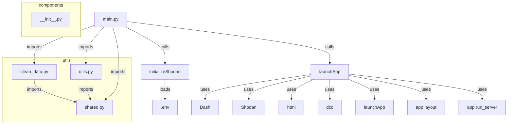

# Project CRIME/CAMERAS

This project serves as a proof-of-concept of correlating crime rates with the number of cameras throughout France. Specifically aimed at 2016-2023 due to a lack of data before and afterwards.

### Table of Contents

- [User Guide](#user-guide)
    - [Downloading](#downloading)
    - [Installing](#installing)
    - [Running](#running)
- [Data](#data)
    - [Sources](#sources)
    - [Usage](#usage)
- [Developer Guide](#developer-guide)
    - [Main files](#main-files)
- [Analysis Report](#analysis-report)
- [License](#license)

## User Guide

### Downloading
Simply `git clone` this repository.
Sample command below:

```sh
git clone https://github.com/Secr3ts/Projet_Shodan
```

### Installing
This project supposedly works with `Python 3.11.x`.
However for maximum compatibility please use [`Python 3.11`](https://www.python.org/downloads/release/python-3119/)

### Running
To run the dashboard just type `python main.py` and visit [this](http://localhost:leportenquestion) page.

## Data

### Sources
The data used in this project comes from:
- [INSEE](insee.fr) (french cities outline)
- [GOUV.fr](data.gouv.fr) (crime rates ranging from year 2016 to 2023)
- [Shodan](shodan.io) (publicly available cameras)
- [Overpass Turbo](https://overpass-turbo.eu/) (Secondary source for publicly available cameras)

### Usage
aaaa

## Developer Guide


## Analysis Report
analysis report

## License

We certify and swear on our honor that each line of code that has been borrowed is credited to its righteous owner and everything else is solely ours. All ressemblance with an existing project/file is purely a coincidence.