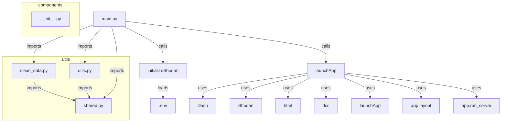

# Project CRIME/CAMERAS

This project serves as a proof-of-concept of correlating crime rates with the number of cameras throughout France. Specifically aimed at 2016-2023 due to a lack of data before and after this period.

### Table of Contents

- [User Guide](#user-guide)
    - [Downloading](#downloading)
    - [Installing](#installing)
    - [Running](#running)
- [Data](#data)
    - [Sources](#sources)
    - [Usage](#usage)
- [Developer Guide](#developer-guide)
    - [Main files](#main-files)
- [Analysis Report](#analysis-report)
- [License](#license)

## User Guide

### Downloading
Simply `git clone` this repository.
Sample command below:

```sh
git clone https://github.com/Secr3ts/Projet_Shodan
```

### Installing
This project works with `Python 3.11.x`.
For maximum compatibility, please use [`Python 3.11`](https://www.python.org/downloads/release/python-3119/).

### Running
To run the dashboard, cd into the Projet_Shodan directory and type `python main.py`. Then visit [this](http://localhost:8050) page.

## Data

### Sources
The data used in this project comes from:
- [INSEE](https://insee.fr) (French cities outline)
- [GOUV.fr](https://data.gouv.fr) (crime rates ranging from 2016 to 2023)
- [Shodan](https://shodan.io) (publicly available cameras)
- [Overpass Turbo](https://overpass-turbo.eu/) (secondary source for publicly available cameras)

### Usage
aaaa

## Developer Guide
The code is structured in two main parts:
- A backend that fetches data, cleans it, and stores it
- A frontend that makes use of this data and displays it accordingly for the user to view.

Putting it simply, the program first calls `get_data` located in `get_data.py` to fetch all the data, then `get_data` calls the cleansing functions of each data retrieved and moves them to the cleaned folder.

## __!!partie a thibault!!__

Below is a diagram that explains the relations between different files of our codebase.


## Analysis Report

With the extracted data, our dashboard led to the following conclusions:

- Each year, the crime rate is on the rise.
- This implicitly leads to an increase in security camera installations (cf. causality).

The crime rates dataset specifically showed that the closer to a big city, the higher the risk which is a proven fact.

However, everything needs to be taken with a grain of salt, as the data we have selected has been proven to be incomplete. For example, the crime dataset has data that is not disclosed (see [this](./lienverslemetadata/))

## Copyright

We certify and swear on our honor that each line of code that has been borrowed is credited to its rightful owner and everything else is solely ours. All resemblance with an existing project/file is purely coincidental.